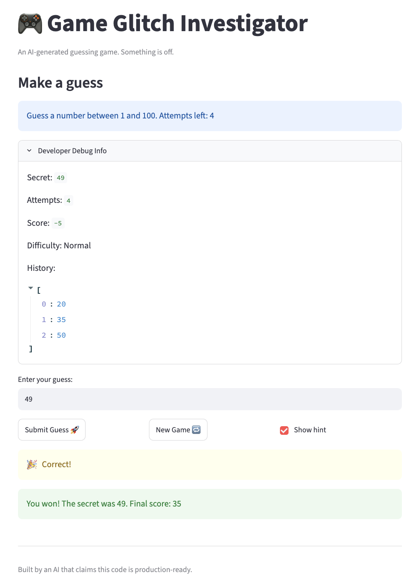

# 🎮 Game Glitch Investigator: The Impossible Guesser

## 🚨 The Situation

You asked an AI to build a simple "Number Guessing Game" using Streamlit.
It wrote the code, ran away, and now the game is unplayable. 

- You can't win.
- The hints lie to you.
- The secret number seems to have commitment issues.

## 🛠️ Setup

1. Install dependencies: `pip install -r requirements.txt`
2. Run the broken app: `python -m streamlit run app.py`

## 🕵️‍♂️ Your Mission

1. **Play the game.** Open the "Developer Debug Info" tab in the app to see the secret number. Try to win.
2. **Find the State Bug.** Why does the secret number change every time you click "Submit"? Ask ChatGPT: *"How do I keep a variable from resetting in Streamlit when I click a button?"*
3. **Fix the Logic.** The hints ("Higher/Lower") are wrong. Fix them.
4. **Refactor & Test.** - Move the logic into `logic_utils.py`.
   - Run `pytest` in your terminal.
   - Keep fixing until all tests pass!

## 📝 Document Your Experience

- [x] Describe the game's purpose.
  - The game is an entertaining guessing number in which the user gets clues after entering their guesses. To make the game more challenging, thera a specific amount of times the user can try to guess, as well as different levels of difficulty.
- [x] Detail which bugs you found.
   1. The clues were innacurate
   2. The game did not start again after losing
   3. Difficulty categories were mixed up
   4. Attempts allowed was shifted by one less
   
- [x] Explain what fixes you applied.
   1. Fixed if statement in charge of giving clues so it worked accurately
   2. Fixed setting state of "re-starting" game so th eplayer could succesfully try again after losing.
   3. Attempts are counted accurately 

## 📸 Demo Walkthrough

Describe your fixed game in numbered steps so a reader can follow along without watching a video:

1. User enters "60" as guess 
2. Game returns "📉 Go LOWER!"
3. User enters a gues of "55"
4. Game says "📉 Go LOWER!"
5. User enters a gues of 20
6. Game returns "📈Go HIGHER!"
7. User enters "45"
8. Game returns: 
   "🎉 Correct!   
   You won! The secret was 45. Final score: 35" 

**Screenshot** *(optional)*: 

## 🧪 Test Results

```
========================================================== test session starts ===========================================================
platform darwin -- Python 3.13.13, pytest-9.0.3, pluggy-1.6.0
rootdir: /Users/camila/ai110-module1show-gameglitchinvestigator-starter
plugins: anyio-4.13.0
collected 6 items                                                                                                                        

tests/test_game_logic.py ......                                                                                                    [100%]

=========================================================== 6 passed in 0.01s ============================================================
```

## 🚀 Stretch Features

- [x] Challenge 1: Advanced Edge-Case Testing:
```
========================================================== test session starts ===========================================================
platform darwin -- Python 3.13.13, pytest-9.0.3, pluggy-1.6.0
rootdir: /Users/camila/ai110-module1show-gameglitchinvestigator-starter
plugins: anyio-4.13.0
collected 16 items                                                                                                                       

tests/test_edge_cases.py ................                                                                                          [100%]

=========================================================== 16 passed in 0.01s ===========================================================
```
- [ ] [If you choose to complete Challenge 4, describe the Enhanced UI changes here — a screenshot is optional]
